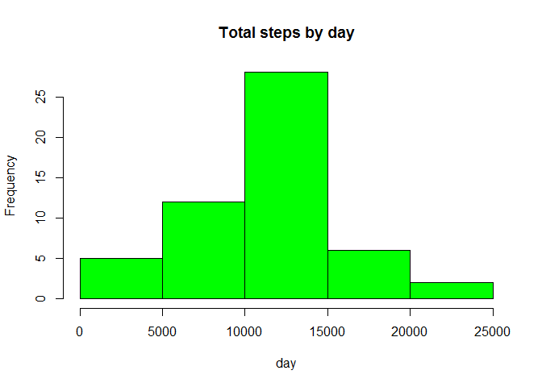
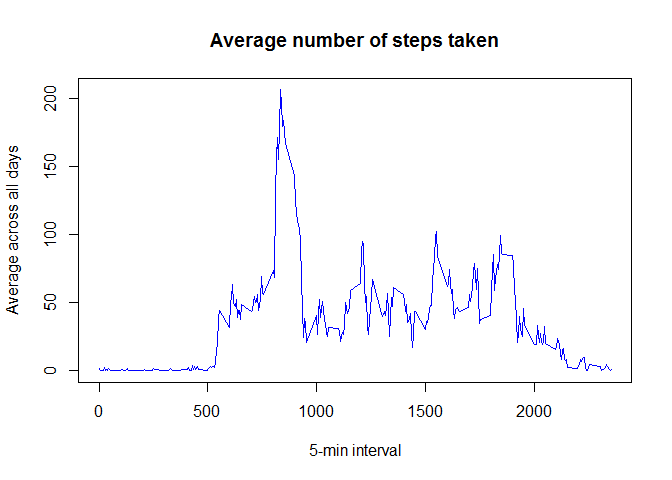
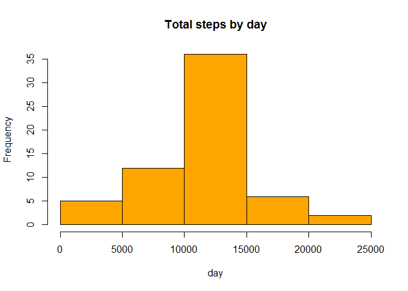

# Reproducible Research: Peer Assessment 1

by Anton Kulichenko

## Loading and preprocessing the data

Provided that the .Rmd file and activity.csv file are in the same folder, let's read the
data from .csv into "data" variable:


```r
options(warn=-1)
data<-read.csv("activity.csv")
```

Here are the first 5 rows of the dataset we have read:


```r
head(data)
```

```
##   steps       date interval
## 1    NA 2012-10-01        0
## 2    NA 2012-10-01        5
## 3    NA 2012-10-01       10
## 4    NA 2012-10-01       15
## 5    NA 2012-10-01       20
## 6    NA 2012-10-01       25
```

## What is mean total number of steps taken per day?

Let us aggregate the number of steps by date:


```r
stepsByDate <- aggregate(steps ~ date, data = data, sum, na.rm = TRUE)
```

The distribution of steps is presented on the following histogram:


```r
hist(stepsByDate$steps, main = "Total steps by day", xlab = "day", col = "green")
```

 

The mean of the total number of steps is:


```r
mean(stepsByDate$steps)
```

```
## [1] 10766.19
```

And the median is:


```r
median(stepsByDate$steps)
```

```
## [1] 10765
```

## What is the average daily activity pattern?

First, we will calculate the average number of steps for each interval:


```r
time_series <- tapply(data$steps, data$interval, mean, na.rm = TRUE)
```

And then will build a plot 


```r
plot(row.names(time_series), time_series, type = "l", xlab = "5-min interval", 
    ylab = "Average across all days", main = "Average number of steps taken", 
    col = "blue")
```

 

The 5-minute interval with the maximum number of steps is:


```r
max_interval <- which.max(time_series)
names(max_interval)
```

```
## [1] "835"
```

## Inputing missing values

The total number of NAs in the dataset is:


```r
total_NA <- sum(is.na(data))
total_NA
```

```
## [1] 2304
```


```r
aveSteps <- aggregate(steps ~ interval, data = data, mean)
fillNA <- numeric()
for (i in 1:nrow(data)) {
    obs <- data[i, ]
    if (is.na(obs$steps)) {
        steps <- subset(aveSteps, interval == obs$interval)$steps
    } else {
        steps <- obs$steps
    }
    fillNA <- c(fillNA, steps)
}
```

Now we will create a new dataset and will fill the missing values with the average number of steps:


```r
new_data <- data
new_data$steps <- fillNA
```

Let us aggregate the number of steps for the new dataset by date:


```r
stepsByDate2 <- aggregate(steps ~ date, data = new_data, sum, na.rm = TRUE)
```

The distribution of steps is presented on the following histogram:


```r
hist(stepsByDate2$steps, main = "Total steps by day", xlab = "day", col = "orange")
```

 

The mean of the total number of steps is:


```r
mean(stepsByDate2$steps)
```

```
## [1] 10766.19
```

And the median is:


```r
median(stepsByDate2$steps)
```

```
## [1] 10766.19
```

The two histograms are slightly different.

## Are there differences in activity patterns between weekdays and weekends?

Here we will create a two-level vector "daylevels" to categorize our date variable and then ill add the daylevels column into our new dataset (with filled NAs):


```r
wdays <- weekdays(as.Date(new_data$date))
daylevels <- vector()
for (i in 1:nrow(new_data)) {
    if (wdays[i] == "Saturday") {
        daylevels[i] <- "Weekend"
    } else if (wdays[i] == "Sunday") {
        daylevels[i] <- "Weekend"
    } else {
        daylevels[i] <- "Weekday"
    }
}
new_data$daylevels <- daylevels
new_data$daylevels <- factor(new_data$daylevels)

stepsByDay <- aggregate(steps ~ interval + daylevels, data = new_data, mean)
names(stepsByDay) <- c("interval", "daylevels", "steps")
```

This is the histogram illustrating differences in activity on weekdays and on weekends:


```r
library(lattice)
xyplot(steps ~ interval | daylevels, stepsByDay, type = "l", layout = c(1, 2), 
    xlab = "Interval", ylab = "Number of steps")
```

 
